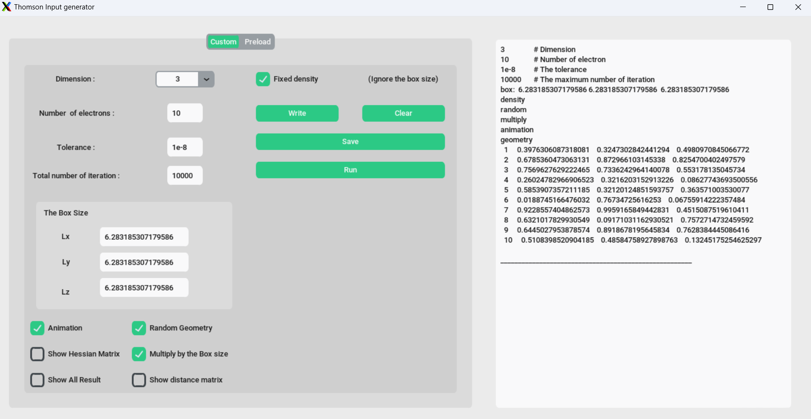

<br />
<div align="center">
  <a href="https://github.com/ALRAKIK/Thomson">
    
  </a>

  <h3 align="center">Thomson Project</h3>

  <p align="center">
    Solve Thomson problem in Clifford tori for one, two and three dimension
    <br />
    <a href="https://github.com/ALRAKIK/Thomson"><strong>Explore the Project »</strong></a>
    <br />
    <br />
  </p>
</div>

<!-- TABLE OF CONTENTS -->
<details>
  <summary>Table of Contents</summary>
  <ol>
    <li>
      <a href="#thomson">About The Project</a>
    </li>
    <li>
      <a href="#prerequisite">Getting Started</a>
      <ul>
        <li><a href="#prerequisite">Prerequisites</a></li>
        <li><a href="#build">Build</a></li>
      </ul>
    </li>
    <li><a href="#usage">Usage</a></li>
    <li><a href="#example">Example</a></li>
    <li><a href="#contact">Contact</a></li>
    <li><a href="#license">License</a></li>
    <li><a href="#acknowledgments">Acknowledgments</a></li>
  </ol>
</details>

# Thomson 
The Thomson problem is a classic problem in physics and mathematics that deals with finding the minimum energy configuration of a collection of point charges (electrons) on the surface of a sphere. The problem was first proposed by the physicist J.J. Thomson in 1904, and it has been studied extensively since then.

The Thomson problem has many applications in physics and chemistry, including the study of atomic and molecular structures. The problem is also of interest in mathematics and computer science, as it involves finding the optimal arrangement of a large number of points in three-dimensional space.

Thomson program has been developed to solve the Thomson problem inside the torus. This program uses Conjucated gradient mathematical technique and computational algorithms to find the optimal configuration of charges on the surface of a torus, which is a doughnut-shaped object.

The program written using FORTRAN 90 language with Python3 GUI to help the user making the input files and running the program.

We define the euclidean distance in the torus by the expression: 

```math
d_{i j}=\sqrt{\sum_{\alpha=1}^n\left[\frac{L_\alpha}{\pi} \sin \left(\frac{\pi}{L_\alpha}\left[x_{\alpha, i}-x_{\alpha, j}\right]\right)\right]^2}
```



# Prerequisite

* 1 - Fortran compiler (gfortran 9.4 recommended):

```
sudo apt install gfortran
```
* 2 - Fortran library (llapack, openmp):
  
```
sudo apt install liblapack-dev libopenblas-dev libomp-dev
```
* 3 - For animation (gnuplot, FFmpeg):

```
sudo apt install gnuplot ffmpeg
```
* 4 - Python (Python 3, not working using python 2 because it need some library )

```
sudo apt install python3 python3-pip
```
* 5 - Python library (numpy,tkinter,customtkinter) to use the python GUI

```
sudo apt install python3-tk
pip3 install customtkinter numpy 
```

 
# Build

* build the program
  
```sh
make Thomson
```
* clean the bin files
```sh
make clean
```
# Usage 

* Using Python code

```sh
python Thomson.py
``` 
* Thomson

```sh
./Thomson "The input file name"
```

* Input file

First line to identify the number of dimension  1,2 or 3.

Second line to identify the number of electrons         .

Third line for the tolerance                            .

Fourth line for the maximum number of iteration         .

then the user can add any keywords for the list (with any order) :

| keywords                     | type  | Description | 
| :---                         |  :--- |     :---       |
| box: real real real        |`char`  `real` `real` `real` | change the size of the box on x,y,z  "default $2\pi,2\pi,2\pi$" |
| random (optional)            |`char` |  start from random geometry (every axis have a random number between  [0,1]  |
| multiply (optional)          |`char` | multiply the input geometry by the size of the box and distrubute the electron all over the box |
| show (optional)              |`char` | show all the result (the geometry in every step of iteration, energy of the system , and the norm of the gradient) |
| density (optional)           |`char` | choose a fixed density (one electron per the unit of length) and ignore the size of the box written before or after  |
| density rectangle (optional) |`char` `char`| choose a fixed density (one electron per the unit of length) in case of 2D if user want to choose the ratio between the first and the second axis as $\sqrt(3)/2$  |
| hessian (optional)           |`char` | show the hessian matrix at the convergance |
| distance (optional)          |`char` | show the euclidean and the geodesic matrix at the convergance |
| animation (optional)         |`char` | make a video for the optimizations steps or if the user are at a fixed point (minimum or saddle point) gives a picture  |
| animation origin (optional)  |`char` `char` | same as animation but force one electron to be at the origin of the torus [0,0,0] |

geometry (the last keywork) , user have to define the input geometry below it until he reach the last number of electron like this: 

```sh
geometry
1   real real real 
2   real real real
3   real real real
.
.
.
.
```


# Example

there are some example of the inputfile in the [examples folder](https://github.com/ALRAKIK/Thomson/tree/main/example) you can try to use them.
  
# Contact

Stefano Evangelisti - stefano.lcpq@gmail.com

Arjan Berger - arjan.berger@irsamc.ups-tlse.fr

Amer Alrakik - alrakikamer@gmail.com

Project Link: [https://github.com/ALRAKIK/Thomson](https://github.com/ALRAKIK/Thomson)

# License

Distributed under the MIT License. See `LICENSE.txt` for more information.

# Acknowledgments

Thanks to Miguel Escobar Azor [orcid](https://orcid.org/0000-0002-8090-0820)
